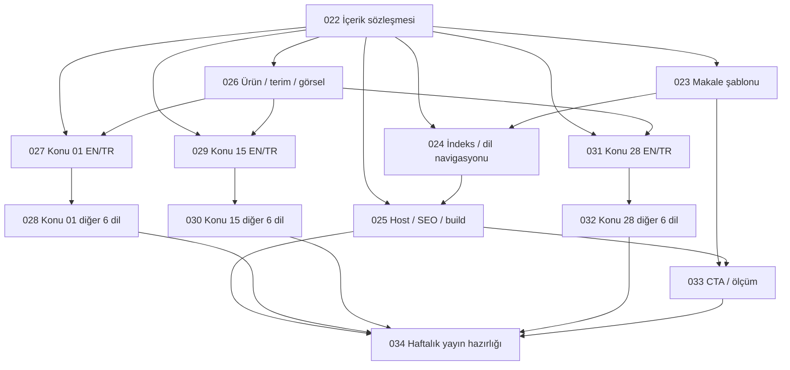

# Breakdown: Rockimals için sekiz dilde haftalık blog ve organik edinim akışını kur

**Source:** [Epic 021](../specs/021-rockimals-multilingual-blog-growth.md)
**Editorial plan:** [52 konu ve ilk 13 haftanın sırası](rockimals-blog-plani-2026-09-22.md)
**Prepared:** 2026-09-22
**Status:** Breakdown complete — implementation not started

## Strategy

Bağımlılık temelli ayrıştırmayı küçük kullanıcı/üretim çıktılarıyla birleştiriyoruz. Epic; çok dilli kaynak modeli, şablon, host/SEO, görseller, 24 metin, mağaza yönlendirmesi ve haftalık işletimi aynı teslimatta topladığı için tek uygulama turuna büyük geliyor.

13 alt spec oluşturuldu. Önce ortak içerik/yayın sözleşmesi kurulur. Tasarım ve editoryal hazırlık bu sözleşmeden sonra birbirini beklemeden ilerleyebilir. Her konu için İngilizce/Türkçe kaynak ile kalan altı dil ayrı içerik işleri olur; her dil için ayrı, tekrarlı spec açılmaz. Üç konu birden tek yazı üretim işine de sıkıştırılmaz.

Teknik işler ortak dosya sahipliğiyle; içerik işleri konu/dil dosyalarıyla sınırlandırıldı. Böylece aynı kabul şartı için birden fazla bağımsız uygulama tasarımı oluşmaz. Son iş, önceki çıktıları gerçek içerikle birleştirir ve yayın hazırlığını kaydeder.

Tüm alt işler **P2**'dir: ana epic'teki normal planlı çalışma önceliği korunur; sırayı öncelik etiketleri değil bağımlılıklar belirler. Acele yayın veya tarih varsayımı eklenmedi. Sekiz dil, haftada bir konu ve ilk üç konu/24 sayfa kararı aynen korunur.

## Work Items

Aşağıdaki özetlerin bağlayıcı kapsamı ve doğrulaması bağlantılı spec'tedir; kabul kriterleri bu belgede ikinci bir bağımsız liste olarak tutulmaz.

### Item 1: İçerik modeli ve sekizli yayın uygunluğu

**Spec:** [022](../specs/022-rockimals-blog-content-contract.md)
**Type:** Feature
**Priority:** P2
**Depends on:** None

**Description:** Üç başlangıç konusunun aynı kurallarla hazırlanabileceği çok dilli kaynak modeli ve deterministik yayın seçimi oluştur. Bu iş içerik/veri katmanının sahibidir; son sayfa tasarımı ve host yönlendirmesi başka spec'lerdedir.

**Acceptance Criteria:** [022 kabul kriterleri](../specs/022-rockimals-blog-content-contract.md#acceptance-criteria). Bu spec'in çıktısı: İçerik sözleşmesinin ve şablonun yolları, alan kararları, tarih yorumu, seçilen paket davranışı ve doğrulama kanıtı. Sonraki kod işleri ile editoryal hazırlık bu sözleşmeyi kullanır.

### Item 2: Makale tasarımı ve erişilebilirlik

**Spec:** [023](../specs/023-rockimals-blog-article-template.md)
**Type:** Feature
**Priority:** P2
**Depends on:** [022](../specs/022-rockimals-blog-content-contract.md)

**Description:** Okuyucuya sorunun cevabını ve ilgili oyun deneyimini gösteren, uzun okumaya uygun Rockimals yazı sayfası oluştur. Bu iş makale HTML/CSS'sinin sahibidir; mağaza hedefinin çözülmesi 033'e aittir.

**Acceptance Criteria:** [023 kabul kriterleri](../specs/023-rockimals-blog-article-template.md#acceptance-criteria). Bu spec'in çıktısı: Makale şablonu/stil yolları, CTA entegrasyon alanı, yerel önizleme yöntemi ve görsel/erişilebilirlik inceleme notu.

### Item 3: Blog indeksleri ve aynı konuya dil geçişi

**Spec:** [024](../specs/024-rockimals-blog-index-navigation.md)
**Type:** Feature
**Priority:** P2
**Depends on:** [022](../specs/022-rockimals-blog-content-contract.md), [023](../specs/023-rockimals-blog-article-template.md)

**Description:** Okuyucunun blogu ürün sayfasından bulmasını, yazıları kendi dilinde keşfetmesini ve aynı makalenin başka diline geçmesini sağla. Bu iş navigasyon ve indeksin sahibidir; host kuralları 025'e aittir.

**Acceptance Criteria:** [024 kabul kriterleri](../specs/024-rockimals-blog-index-navigation.md#acceptance-criteria). Bu spec'in çıktısı: İndeks ve navigasyon yolları, sekiz dil etiketleri, dil eşleme davranışı ve görsel/klavye inceleme kanıtı.

### Item 4: Host, SEO ve güvenli build çıktısı

**Spec:** [025](../specs/025-rockimals-blog-host-seo-build.md)
**Type:** Feature
**Priority:** P2
**Depends on:** [022](../specs/022-rockimals-blog-content-contract.md), [024](../specs/024-rockimals-blog-index-navigation.md)

**Description:** Hazırlanan blog sayfalarını doğru Rockimals adreslerinde, taranabilir ve mevcut siteleri koruyan bir üretim hattıyla sun. Bu iş build entegrasyonu, route/metadata ve çıktı sınırının tek sahibidir.

**Acceptance Criteria:** [025 kabul kriterleri](../specs/025-rockimals-blog-host-seo-build.md#acceptance-criteria). Bu spec'in çıktısı: Build sırası, host route kararları, çıktı sahipliği, doğrulama kanıtları ve kalan yalnızca canlıda kontrol edilebilen maddeler; 034 yayın hazırlığında kullanır.

### Item 5: Ürün referansı, terimler ve üç görsel paketi

**Spec:** [026](../specs/026-rockimals-blog-editorial-assets.md)
**Type:** Task
**Priority:** P2
**Depends on:** [022](../specs/022-rockimals-blog-content-contract.md)

**Description:** Yazı üretimini eski repo notları veya yanlış görseller yerine doğrulanmış ürün bilgisi ve ortak terimlerle başlat. Bu iş ilk üç konuya ait ortak ürün referansının, terim listesinin ve görsel paketlerinin sahibidir.

**Acceptance Criteria:** [026 kabul kriterleri](../specs/026-rockimals-blog-editorial-assets.md#acceptance-criteria). Bu spec'in çıktısı: Ortak referans, terim listesi, üç görsel paketi ve manifest yolları; sürüm/tarih; varsa çözülmemiş ürün veya dil kanıtı.

### Item 6: Konu 01: İngilizce/Türkçe kaynak

**Spec:** [027](../specs/027-rockimals-blog-getting-started-en-tr.md)
**Type:** Task
**Priority:** P2
**Depends on:** [022](../specs/022-rockimals-blog-content-contract.md), [026](../specs/026-rockimals-blog-editorial-assets.md)

**Description:** Ürünü ilk kez değerlendiren ebeveyn ve oyuncuya Radar'da ilk ziyaretçiyi bulma, bilgi kartını açma ve ilgili hikâyeye geçişi anlat. Tek konunun kaynak yazısı ve Türkçe uyarlaması bu işin kapsamıdır; kalan altı dil ayrı spec'tedir.

**Acceptance Criteria:** [027 kabul kriterleri](../specs/027-rockimals-blog-getting-started-en-tr.md#acceptance-criteria). Bu spec'in çıktısı: İki kaynak dosyası, ortak brief, incelenen kaynak/pazar kaydı, konuya özgü çeviri notları ve çözülmüş/açık inceleme maddeleri.

### Item 7: Konu 01: diğer altı dil

**Spec:** [028](../specs/028-rockimals-blog-getting-started-six-locales.md)
**Type:** Task
**Priority:** P2
**Depends on:** [027](../specs/027-rockimals-blog-getting-started-en-tr.md)

**Description:** Konu 01 için doğrulanmış kaynak brief ve İngilizce metinden Japonca, Korece, Basitleştirilmiş Çince, Fransızca, Almanca ve İspanyolca uyarlamalar üret; sekizli içerik paketini tamamla.

**Acceptance Criteria:** [028 kabul kriterleri](../specs/028-rockimals-blog-getting-started-six-locales.md#acceptance-criteria). Bu spec'in çıktısı: Altı kaynak dosyası, sekizli envanter, her dilin arama/inceleme kaydı ve varsa çözülmemiş konuya özgü maddeler.

### Item 8: Konu 15: İngilizce/Türkçe kaynak

**Spec:** [029](../specs/029-rockimals-blog-asteroid-guide-en-tr.md)
**Type:** Task
**Priority:** P2
**Depends on:** [022](../specs/022-rockimals-blog-content-contract.md), [026](../specs/026-rockimals-blog-editorial-assets.md)

**Description:** Markayı bilmeyen aileye asteroidi anlaşılır biçimde açıklayan, uygulama indirmeden de faydalı olan bir bilim yazısı hazırla. Tek konunun kaynak yazısı ve Türkçe uyarlaması bu işin kapsamıdır; kalan altı dil ayrı spec'tedir.

**Acceptance Criteria:** [029 kabul kriterleri](../specs/029-rockimals-blog-asteroid-guide-en-tr.md#acceptance-criteria). Bu spec'in çıktısı: İki kaynak dosyası, ortak brief, incelenen kaynak/pazar kaydı, konuya özgü çeviri notları ve çözülmüş/açık inceleme maddeleri.

### Item 9: Konu 15: diğer altı dil

**Spec:** [030](../specs/030-rockimals-blog-asteroid-guide-six-locales.md)
**Type:** Task
**Priority:** P2
**Depends on:** [029](../specs/029-rockimals-blog-asteroid-guide-en-tr.md)

**Description:** Konu 15 için doğrulanmış kaynak brief ve İngilizce metinden Japonca, Korece, Basitleştirilmiş Çince, Fransızca, Almanca ve İspanyolca uyarlamalar üret; sekizli içerik paketini tamamla.

**Acceptance Criteria:** [030 kabul kriterleri](../specs/030-rockimals-blog-asteroid-guide-six-locales.md#acceptance-criteria). Bu spec'in çıktısı: Altı kaynak dosyası, sekizli envanter, her dilin arama/inceleme kaydı ve varsa çözülmemiş konuya özgü maddeler.

### Item 10: Konu 28: İngilizce/Türkçe kaynak

**Spec:** [031](../specs/031-rockimals-blog-parent-guide-en-tr.md)
**Type:** Task
**Priority:** P2
**Depends on:** [022](../specs/022-rockimals-blog-content-contract.md), [026](../specs/026-rockimals-blog-editorial-assets.md)

**Description:** İndirme kararını veren ebeveynin reklam, hesap, dış bağlantı, satın alma ve veri işleme sorularını doğru cevapla. Tek konunun kaynak yazısı ve Türkçe uyarlaması bu işin kapsamıdır; kalan altı dil ayrı spec'tedir.

**Acceptance Criteria:** [031 kabul kriterleri](../specs/031-rockimals-blog-parent-guide-en-tr.md#acceptance-criteria). Bu spec'in çıktısı: İki kaynak dosyası, ortak brief, incelenen kaynak/pazar kaydı, konuya özgü çeviri notları ve çözülmüş/açık inceleme maddeleri.

### Item 11: Konu 28: diğer altı dil

**Spec:** [032](../specs/032-rockimals-blog-parent-guide-six-locales.md)
**Type:** Task
**Priority:** P2
**Depends on:** [031](../specs/031-rockimals-blog-parent-guide-en-tr.md)

**Description:** Konu 28 için doğrulanmış kaynak brief ve İngilizce metinden Japonca, Korece, Basitleştirilmiş Çince, Fransızca, Almanca ve İspanyolca uyarlamalar üret; sekizli içerik paketini tamamla.

**Acceptance Criteria:** [032 kabul kriterleri](../specs/032-rockimals-blog-parent-guide-six-locales.md#acceptance-criteria). Bu spec'in çıktısı: Altı kaynak dosyası, sekizli envanter, her dilin arama/inceleme kaydı ve varsa çözülmemiş konuya özgü maddeler.

### Item 12: Mağaza CTA'sı ve ölçüm sözleşmesi

**Spec:** [033](../specs/033-rockimals-blog-conversion-measurement.md)
**Type:** Feature
**Priority:** P2
**Depends on:** [023](../specs/023-rockimals-blog-article-template.md), [025](../specs/025-rockimals-blog-host-seo-build.md)

**Description:** Okuyucunun doğru mağazaya geçmesini sağla ve organik tıklama, mağaza ilgisi, indirme, kullanım verisini birbirine karıştırmadan raporlayacak temeli kur. Bu iş CTA hedef çözümlemesi ve ölçüm tanımlarının sahibidir.

**Acceptance Criteria:** [033 kabul kriterleri](../specs/033-rockimals-blog-conversion-measurement.md#acceptance-criteria). Bu spec'in çıktısı: CTA çözümleme/config yolları, mağaza doğrulama tarihi, ölçüm kaydı ve inceleme şablonları, dış erişim/kampanya durumu.

### Item 13: Haftalık işletim ve birleşik yayın hazırlığı

**Spec:** [034](../specs/034-rockimals-blog-weekly-publishing-readiness.md)
**Type:** Task
**Priority:** P2
**Depends on:** [025](../specs/025-rockimals-blog-host-seo-build.md), [028](../specs/028-rockimals-blog-getting-started-six-locales.md), [030](../specs/030-rockimals-blog-asteroid-guide-six-locales.md), [032](../specs/032-rockimals-blog-parent-guide-six-locales.md), [033](../specs/033-rockimals-blog-conversion-measurement.md)

**Description:** Önceki işlerin çıktısını gerçek 24 yazı ile birleştir, üç konuluk tamponu ve haftada bir sekizli paket düzenini teslim et. Bu iş yayın işletimi, bütünleşik kabul kaydı ve kalan kararların sahibidir; altyapı veya yazı üretimini tekrar yapmaz.

**Acceptance Criteria:** [034 kabul kriterleri](../specs/034-rockimals-blog-weekly-publishing-readiness.md#acceptance-criteria). Bu spec'in çıktısı: Yayın runbook'u ve kayıt yolu, 24 kaynak matrisi, yedi ana kriterin kanıtı, açık operasyon kararları, varsa gerçekten oluşmuş canlı yayın kaydı.

## Dependency Structure

Önerilen çalışma sırası:

1. **022**: ortak kaynak ve yayın kuralları.
2. **023 ve 026**: şablon ile ürün/görsel hazırlığı ayrı ilerleyebilir.
3. **024** şablonu izler. **027, 029, 031** ürün/görsel referansı hazırken ayrı konu dosyalarında ilerleyebilir.
4. **025** indeks/navigasyonu izler. Her konu için **028, 030, 032**, kendi kaynak yazısı tamamlandığında başlayabilir; üçü birbirini beklemek zorunda değildir.
5. **033** host ve makale temeline mağaza/ölçüm akışını bağlar.
6. **034** gerçek 24 kaynakla birleşik kabul ve haftalık işletim devrini tamamlar.

Bu paralellik, işlerin bağımsız ilerleme fırsatını gösterir; alt ajan veya yeni Codex task başlatıldığı anlamına gelmez. Aynı çalışma ağacında ortak manifest/şablon değişikliklerinin sahibi ilgili teknik spec'tir; içerik işleri kendi konu/dil dosyalarıyla sınırlı kalır.

## Coverage Check

### Ana kabul kriterleri

| Epic kriteri | Uygulama sahipleri | Birleşik doğrulama |
| --- | --- | --- |
| AC1 — sekiz dil, aynı konu, JS olmadan erişim, yanlış URL | [022](../specs/022-rockimals-blog-content-contract.md) model; [023](../specs/023-rockimals-blog-article-template.md) makale; [024](../specs/024-rockimals-blog-index-navigation.md) dil geçişi; [025](../specs/025-rockimals-blog-host-seo-build.md) route/404 | [034](../specs/034-rockimals-blog-weekly-publishing-readiness.md) gerçek içerik |
| AC2 — tasarım, 390/768/1440 px, CJK, klavye, görseller | [023](../specs/023-rockimals-blog-article-template.md) makale; [024](../specs/024-rockimals-blog-index-navigation.md) indeks; [026](../specs/026-rockimals-blog-editorial-assets.md) görsel varlık | [034](../specs/034-rockimals-blog-weekly-publishing-readiness.md) gerçek metin/görsel |
| AC3 — canonical/hreflang/metadata/sitemap ve çıktı sınırı | [022](../specs/022-rockimals-blog-content-contract.md) uygunluk; [025](../specs/025-rockimals-blog-host-seo-build.md) yayın/SEO; [024](../specs/024-rockimals-blog-index-navigation.md) manifestten bağlantı | [034](../specs/034-rockimals-blog-weekly-publishing-readiness.md) ilk yayın senaryosu |
| AC4 — üç brief, 24 metin, üç kapak, dil doğruluğu ve tampon | [026](../specs/026-rockimals-blog-editorial-assets.md) görseller; [027](../specs/027-rockimals-blog-getting-started-en-tr.md)–[032](../specs/032-rockimals-blog-parent-guide-six-locales.md) konu üretimi | [034](../specs/034-rockimals-blog-weekly-publishing-readiness.md) 3×8 matris |
| AC5 — repo kaynağı, sürüm/tarih, kaynaklı bilim ve dürüst ürün | [026](../specs/026-rockimals-blog-editorial-assets.md) ortak referans; [027](../specs/027-rockimals-blog-getting-started-en-tr.md)–[032](../specs/032-rockimals-blog-parent-guide-six-locales.md) metin uygulaması | [034](../specs/034-rockimals-blog-weekly-publishing-readiness.md) kanıt eşleme |
| AC6 — mağaza yolu, kampanya fallback'i, ayrı ölçüler, takip sınırı | [033](../specs/033-rockimals-blog-conversion-measurement.md) | [034](../specs/034-rockimals-blog-weekly-publishing-readiness.md) gerçek sayfa CTA'sı |
| AC7 — 52 aday, 13 hafta, haftalık sekizli paket, açık kararlar | [033](../specs/033-rockimals-blog-conversion-measurement.md) ölçüm şablonları; [034](../specs/034-rockimals-blog-weekly-publishing-readiness.md) işletim kaydı | [034](../specs/034-rockimals-blog-weekly-publishing-readiness.md) epic devir kaydı |

### Tüm kapsam grupları ve tekil sahiplik

| Kaynak gereksinimi | Tekil ana sahip / destek |
| --- | --- |
| İçerik alanları, kategori kimlikleri, translationKey, tarih yorumu, varsayılan taslak | 022 |
| Kamuya seçilen tam sekizli grup; eksik, gelecek ve taslakların dışlanması | 022 seçimi; 025 fiziksel çıktı |
| Başlangıç HTML'si, kısa cevap, içindekiler, yazar/tarih, kaynaklar, ilgili yazı sunumu | 023; 022 yayımlanabilir bağlantı çözümlemesi |
| Dört yerel kategori, indeks, ürün↔blog ve aynı yazı dil seçimi | 024 |
| Tek canonical yol, mevcut dil yolları, hosta bağlı rewrite/redirect ve 404 | 025 |
| Canonical, hreflang, x-default, sosyal metadata, Article/Breadcrumb | 025 |
| Rockimals robots/sitemap, build sırası, eski çıktı temizliği, kaynak yayın sınırı | 025; 022 uygunluk manifesti |
| Kurumsal blog/feed/CTA ve diğer ürünleri koruma | 025; 023/024 yalnızca Rockimals yüzeyleri |
| Renkler, yazı tipleri, CJK, responsive ve klavye/odak | 023 makale; 024 indeks |
| Üç kapak, portre oranı, kaynak repo görsel kaydı ve orijinalleri koruma | 026; 023 sunum |
| Her dil için başlık, açıklama, alt metin, CTA ve doğal terminoloji | 027–032; 026 ortak terim listesi |
| Her dil/pazar için arama niyeti ve hacim uydurmama | 027/029/031 kaynak çift; 028/030/032 diğer altı dil |
| Ürün sürümü, NASA/kurgu, yaş, ücretsiz/Plus, katalog ve offline/veri iddiaları | 026 referans; 027–032 kendi metni |
| Her yazı için çalışan mağaza CTA'sı, platform kullanılabilirliği, deep link sınırı | 033; 023 sunum alanı |
| Kampanya yapılandırması varsa atıf, yoksa normal link; takip/analitik eklememe | 033 |
| Search Console ve mağaza verisi, veri yok/erişim yok/az veri ayrımı | 033 |
| Başlangıç ve 4/8/13. hafta ölçümü | 033 tanımlar; 034 yayın tarihine bağlama |
| 52 konu/13 hafta tek kaynağı, 24 sayfa tampon, haftalık yayın kaydı | 034; özgün takvim kaynak planda |
| Tamamlanmış çeviri/yerel build ile gerçekten canlı yayını ayırma | 034; her alt spec kendi tamamlanma kanıtı |

### Risk ve bağımlılık kapsamı

| Epic riski / açık bağımlılığı | Taşındığı spec | Korunan sınır |
| --- | --- | --- |
| Ortak Netlify/kurumsal blog zarar görmesi | 022, 025 | Ürün çıktı/host sahipliği, sınırlı temizlik |
| Sekiz dilde kapasite ve yüzeysel çeviri | 026–032, 034 | Kaynak brief, terim listesi, dil incelemesi, üç konuluk tampon |
| Repo/live farklılığı | 026, 027–032, 033 | Sürüm/tarih ve mağaza/platform doğrulaması |
| Arama talebinin belirsizliği | 027–032, 033, 034 | Yerel niyet kaydı, ölçüm ve sıralamayı güncelleme |
| Search Console/App Store erişimi | 033, 034 | Bilinmeyeni kaydetme; tasarım/yazım beklemez |
| Eski ürün dokümanları/görselleri | 026 | Güncel katalog; eski kabul süreçlerini yeniden açmama |
| Başlangıç günü/saatinin belirsizliği | 034 | Önerilen saat onaylanmış sayılmaz |
| Editör/dil inceleme sorumluları | 026–032 inceleme durumları; 034 rol kaydı | Gerçekleşmeyen inceleme tamamlandı sayılmaz |
| Her dilde hedef ülke seçimi | 027–032 | Brief başına pazar varsayımı |
| Manuel/otomatik yayın işletimi | 034 | MVP belgelenmiş akış; otomasyon daha sonra |

### Bilinçli ertelemeler ve kapsam dışı işler

- **Nice-to-haves korunuyor, MVP'ye eklenmiyor:** arama/kategori filtresi/sayfalama, QR, dil bazlı RSS, ilerideki özgün yazdırılabilir etkinlikler, web tıklama analitiği ve yinelenen otomasyon. İlgili ihtiyaç doğduğunda ayrı iş açılabilir.
- **Kalan 49 konu**, yıllık aday havuz ve ilk 13 hafta takviminde kalır. Onların yazılması veya 13 haftalık gerçek performans verisinin oluşması ilk teslimatın kabulüne bağlanmaz.
- Mobil oyun kodu, abonelik modeli, mağaza sürümü, tüm hikâye/final sahnelerinin bloga taşınması, yeni dil, CMS/veritabanı/hesap/e-posta/reklam ve kişiye/çocuğa yönelik takip kapsam dışıdır.
- Genel site/SEO yeniden tasarımı, doğrulanmamış rakip sıralaması, uydurma başarı/arama hacmi ve blogla ilgisiz landing düzeltmeleri eklenmez.
- Bu ayrıştırma commit/push/deploy veya otomasyon başlatmaz. Sonraki uygulama işlerinde oturumdaki mevcut kullanıcı yetkisi esas alınır.
- Oyun reposu salt görsel/ürün kaynağıdır. Orada askıya alınmış test/capture süreçleri web işi nedeniyle yeniden başlatılmaz; site reposunun kendi ilgili kontrolleri uygulanır.

## Suggested Ralph Specs

022–034 dosyaları oluşturuldu; uygulama durumları **Planned**. Ralph kullanımı seçilirse her turda bağımlılıkları tamamlanmış **tek spec** verilir. Kod, üç konu ve altı dil grupları aynı tura yığılmaz. Ralph bu görevde çalıştırılmadı.

| Sıra / paralel grup | Spec | Sınır |
| --- | --- | --- |
| 1 | [022](../specs/022-rockimals-blog-content-contract.md) | Bir ortak içerik/yayın sözleşmesi |
| 2 | [023](../specs/023-rockimals-blog-article-template.md), [026](../specs/026-rockimals-blog-editorial-assets.md) | Ayrı şablon ve editoryal-varlık çıktıları |
| 3 | [024](../specs/024-rockimals-blog-index-navigation.md); [027](../specs/027-rockimals-blog-getting-started-en-tr.md), [029](../specs/029-rockimals-blog-asteroid-guide-en-tr.md), [031](../specs/031-rockimals-blog-parent-guide-en-tr.md) | Bir navigasyon işi veya tek konunun iki dil kaynağı |
| 4 | [025](../specs/025-rockimals-blog-host-seo-build.md); [028](../specs/028-rockimals-blog-getting-started-six-locales.md), [030](../specs/030-rockimals-blog-asteroid-guide-six-locales.md), [032](../specs/032-rockimals-blog-parent-guide-six-locales.md) | Bir host/build işi veya tek konunun altı uyarlaması |
| 5 | [033](../specs/033-rockimals-blog-conversion-measurement.md) | Bir CTA/ölçüm entegrasyonu |
| 6 | [034](../specs/034-rockimals-blog-weekly-publishing-readiness.md) | Başlangıç paketinin birleşik kabul ve işletim devri |

Her iş kendi Completion Record alanına değişen yolları, doğrulamayı, kaynak/inceleme durumunu ve açık maddeleri yazar. 034 ana epic'in yedi kriteri için kanıtı toplar; bu ayrıştırma sırasında hiçbir uygulama kabul kutusu tamamlandı işaretlenmez.
